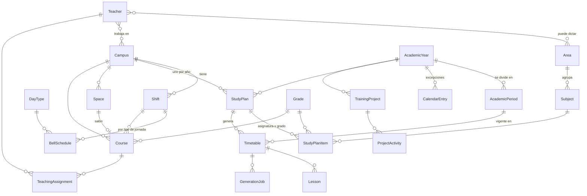

# Modelo de dominio

Glosario: el código usa nombres en inglés; esta tabla los relaciona con los términos de la institución.

| Código | Término | Qué es |
|---|---|---|
| `Institution` | Institución | Datos de la institución (una sola en la v1). |
| `Campus` | Sede | Cada sede ofrece sus propios grados. |
| `Shift` | Jornada | Mañana, Tarde, Sabatina… Días de clase configurables. |
| `DayType` | Tipo de jornada | A (45 min), B (40 min) u otros. Uno es el tipo por defecto. |
| `BellSchedule` / `BellBlock` | Horario de timbre / franja | Por jornada y tipo de jornada: franjas de clase (1..N) y descansos. |
| `Grade` | Grado | Preescolar, 1º … 11º. |
| `Area` / `Subject` | Área / Asignatura | Catálogo institucional. |
| `AcademicYear` | Año lectivo | Fechas, periodos, festivos, recesos y días con jornada especial. |
| `AcademicPeriod` | Periodo académico | Cantidad y fechas configurables por año. |
| `CalendarEntry` | Fecha del calendario | Festivo, receso, jornada pedagógica o día con otro tipo de jornada. |
| `StudyPlan` / `StudyPlanItem` | Plan de estudios / línea | Por año y sede: asignatura × grado con IH y tipo de dictado. |
| `DeliveryMode` | Tipo de dictado | Regular, Transversal (sin franjas, «*») o Contrajornada (otra jornada). |
| `PeriodHours` | IH por periodo | IH distinta en un periodo concreto. |
| `Space` | Espacio | Salón, biblioteca, sala de informática… Una clase a la vez. |
| `Teacher` | Docente | Áreas que dicta, sedes, carga máxima y disponibilidad. |
| `Course` | Curso (grupo) | 6ºA en un año, sede y jornada; con salón y director de grupo. |
| `TeachingAssignment` | Asignación académica | Docente de una asignatura en un curso (manual o propuesta). |
| `Timetable` / `Lesson` | Horario / clase | Horario semanal de una sede para un periodo. |
| `GenerationJob` | Solicitud de generación | Trabajo en segundo plano que ejecuta el motor CP-SAT. |
| `TrainingProject` / `ProjectActivity` | Proyecto de formación / actividad | Proyectos institucionales y obligatorios con actividades en el calendario. |

## Relaciones

## Reglas principales

- **Plan de estudios**: un plan por sede y año lectivo; una línea por asignatura y grado. El total semanal de un grado suma solo las asignaturas regulares (las transversales y las de contrajornada no ocupan franjas de la jornada principal). Un plan aprobado no se edita hasta reabrirlo. Se puede crear copiando otro plan; los ajustes de IH por periodo solo se copian dentro del mismo año.
- **Distribución**: cada línea puede limitar las horas por día y las horas seguidas (bloques) y exigir un tipo de espacio.
- **Horario**: cada clase se ubica en (jornada, día, número de franja). El número de franja se traduce a horas con el horario de timbre del tipo de jornada del día, así el mismo horario sirve para días A y B. No se permiten dos clases del mismo curso, docente o espacio en la misma franja. Las clases fijadas no las mueve el generador.
- **Calendario**: los festivos de Colombia se calculan automáticamente (Ley Emiliani y Pascua). Los recesos, jornadas pedagógicas y días con otro tipo de jornada se agregan a mano o desde las actividades de los proyectos.
- **Asignación académica**: la manual no la cambia el sistema; la propuesta sí.
